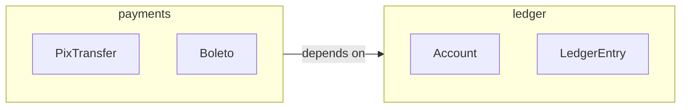

```mermaid
flowchart LR
    subgraph Payments["payments"]
        P1["PixTransfer"]
        P2["Boleto"]
    end
    subgraph Ledger["ledger"]
        L1["Account"]
        L2["LedgerEntry"]
    end
    Payments -->|"depends on"| Ledger
```
