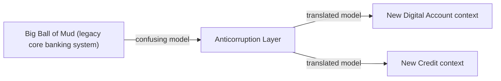

```mermaid
flowchart LR
    BBM["Big Ball of Mud (legacy core banking system)"] -->|"confusing model"| ACL["Anticorruption Layer"]
    ACL -->|"translated model"| N1["New Digital Account context"]
    ACL -->|"translated model"| N2["New Credit context"]
```
