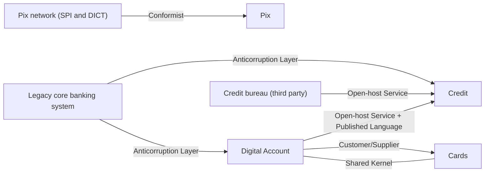

```mermaid
flowchart LR
    CD["Digital Account"] -->|"Open-host Service + Published Language"| CR["Credit"]
    CD -->|"Customer/Supplier"| CA["Cards"]
    CD ---|"Shared Kernel"| CA
    RP["Pix network (SPI and DICT)"] -->|"Conformist"| PX["Pix"]
    L["Legacy core banking system"] -->|"Anticorruption Layer"| CR
    L -->|"Anticorruption Layer"| CD
    BU["Credit bureau (third party)"] -->|"Open-host Service"| CR
```
