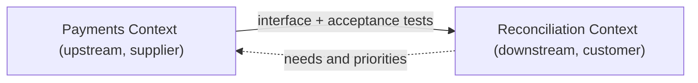

```mermaid
flowchart LR
    U["Payments Context (upstream, supplier)"] -->|"interface + acceptance tests"| D["Reconciliation Context (downstream, customer)"]
    D -.->|"needs and priorities"| U
```
