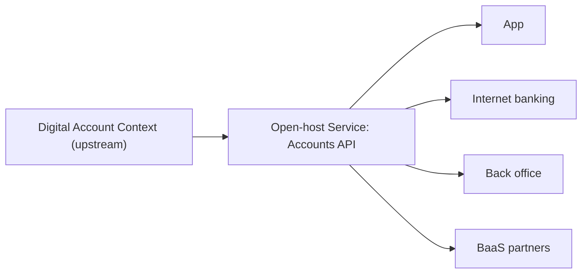

```mermaid
flowchart LR
    U["Digital Account Context (upstream)"] --> OHS["Open-host Service: Accounts API"]
    OHS --> C1["App"]
    OHS --> C2["Internet banking"]
    OHS --> C3["Back office"]
    OHS --> C4["BaaS partners"]
```
