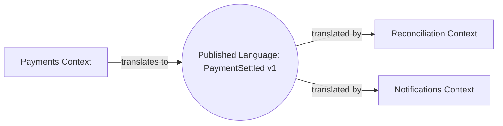

```mermaid
flowchart LR
    A["Payments Context"] -->|"translates to"| PL(("Published Language: PaymentSettled v1"))
    PL -->|"translated by"| B["Reconciliation Context"]
    PL -->|"translated by"| C["Notifications Context"]
```
