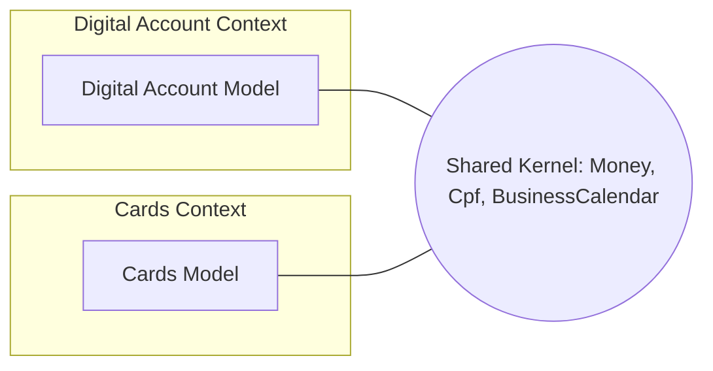

```mermaid
flowchart LR
    subgraph A["Digital Account Context"]
        MA["Digital Account Model"]
    end
    subgraph B["Cards Context"]
        MB["Cards Model"]
    end
    K(("Shared Kernel: Money, Cpf, BusinessCalendar"))
    MA --- K
    MB --- K
```
