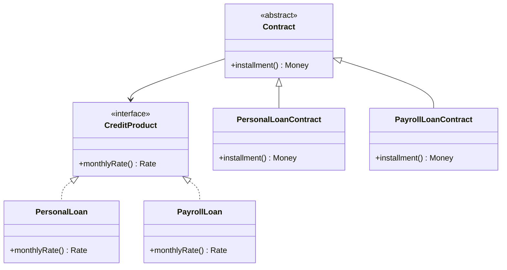

```mermaid
classDiagram
    class CreditProduct {
        <<interface>>
        +monthlyRate() Rate
    }
    class Contract {
        <<abstract>>
        +installment() Money
    }
    class PersonalLoanContract {
        +installment() Money
    }
    class PayrollLoanContract {
        +installment() Money
    }
    class PersonalLoan {
        +monthlyRate() Rate
    }
    class PayrollLoan {
        +monthlyRate() Rate
    }
    Contract --> CreditProduct
    Contract <|-- PersonalLoanContract
    Contract <|-- PayrollLoanContract
    CreditProduct <|.. PersonalLoan
    CreditProduct <|.. PayrollLoan
```
