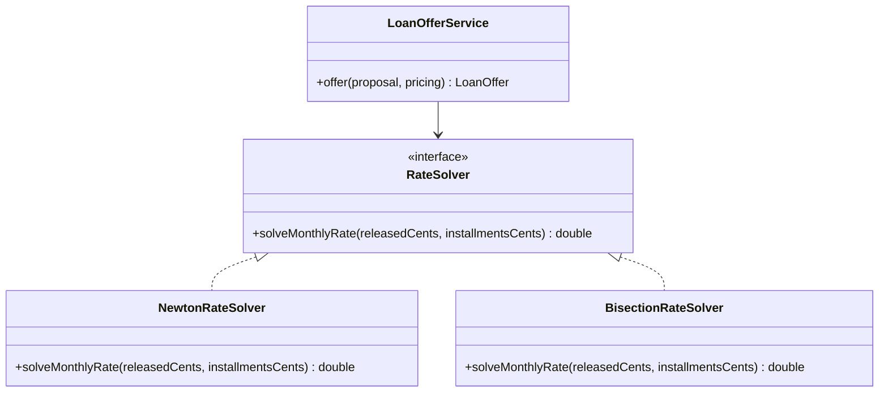

```mermaid
classDiagram
    class LoanOfferService {
        +offer(proposal, pricing) LoanOffer
    }
    class RateSolver {
        <<interface>>
        +solveMonthlyRate(releasedCents, installmentsCents) double
    }
    class NewtonRateSolver {
        +solveMonthlyRate(releasedCents, installmentsCents) double
    }
    class BisectionRateSolver {
        +solveMonthlyRate(releasedCents, installmentsCents) double
    }
    LoanOfferService --> RateSolver
    RateSolver <|.. NewtonRateSolver
    RateSolver <|.. BisectionRateSolver
```
