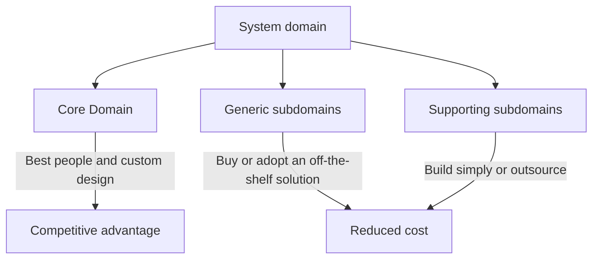

```mermaid
flowchart TD
    A["System domain"] --> B["Core Domain"]
    A --> C["Generic subdomains"]
    A --> D["Supporting subdomains"]
    B -->|"Best people and custom design"| E["Competitive advantage"]
    C -->|"Buy or adopt an off-the-shelf solution"| F["Reduced cost"]
    D -->|"Build simply or outsource"| F
```
