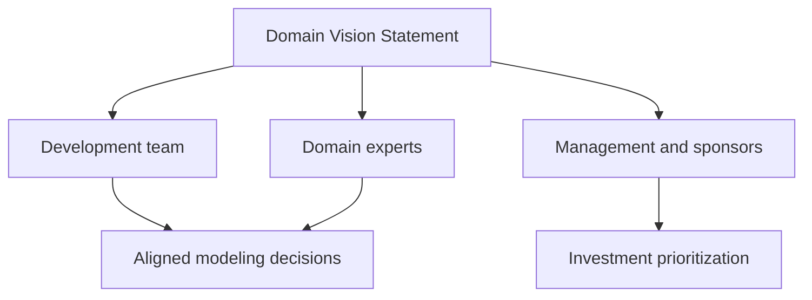

```mermaid
flowchart TD
    A["Domain Vision Statement"] --> B["Development team"]
    A --> C["Domain experts"]
    A --> D["Management and sponsors"]
    B --> E["Aligned modeling decisions"]
    C --> E
    D --> F["Investment prioritization"]
```
