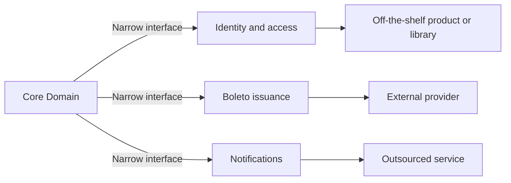

```mermaid
flowchart LR
    A["Core Domain"] -->|"Narrow interface"| B["Identity and access"]
    A -->|"Narrow interface"| C["Boleto issuance"]
    A -->|"Narrow interface"| D["Notifications"]
    B --> E["Off-the-shelf product or library"]
    C --> F["External provider"]
    D --> G["Outsourced service"]
```
