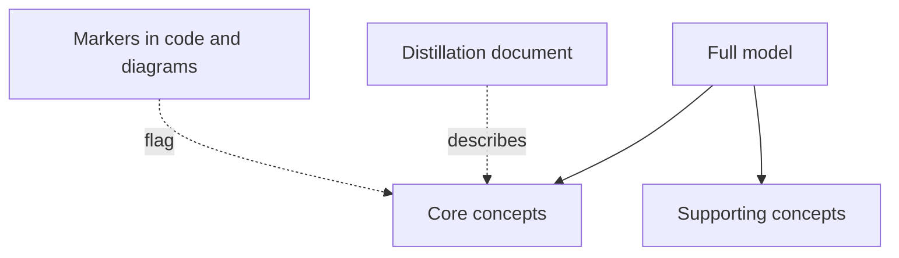

```mermaid
flowchart TD
    A["Full model"] --> B["Core concepts"]
    A --> C["Supporting concepts"]
    D["Distillation document"] -.->|"describes"| B
    E["Markers in code and diagrams"] -.->|"flag"| B
```
