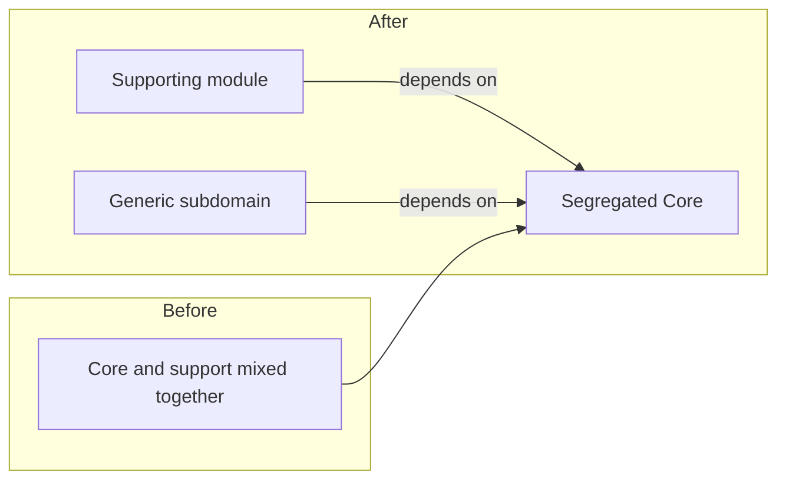

```mermaid
flowchart LR
    subgraph antes["Before"]
        A1["Core and support mixed together"]
    end
    subgraph depois["After"]
        C["Segregated Core"]
        S1["Supporting module"]
        S2["Generic subdomain"]
        S1 -->|"depends on"| C
        S2 -->|"depends on"| C
    end
    A1 --> C
```
