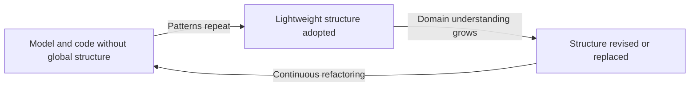

```mermaid
flowchart LR
    A["Model and code without global structure"] -->|"Patterns repeat"| B["Lightweight structure adopted"]
    B -->|"Domain understanding grows"| C["Structure revised or replaced"]
    C -->|"Continuous refactoring"| A
```
