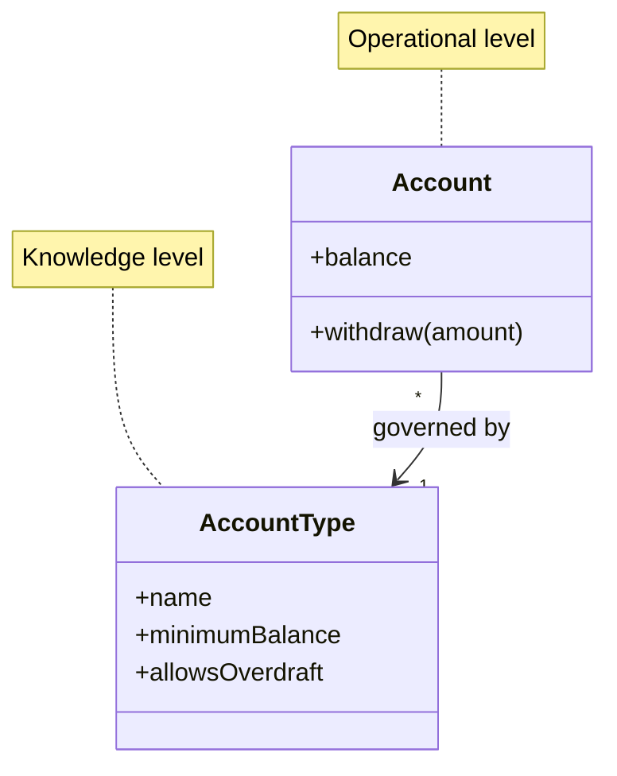

```mermaid
classDiagram
    class AccountType {
        +name
        +minimumBalance
        +allowsOverdraft
    }
    class Account {
        +balance
        +withdraw(amount)
    }
    Account "*" --> "1" AccountType : governed by
    note for AccountType "Knowledge level"
    note for Account "Operational level"
```
