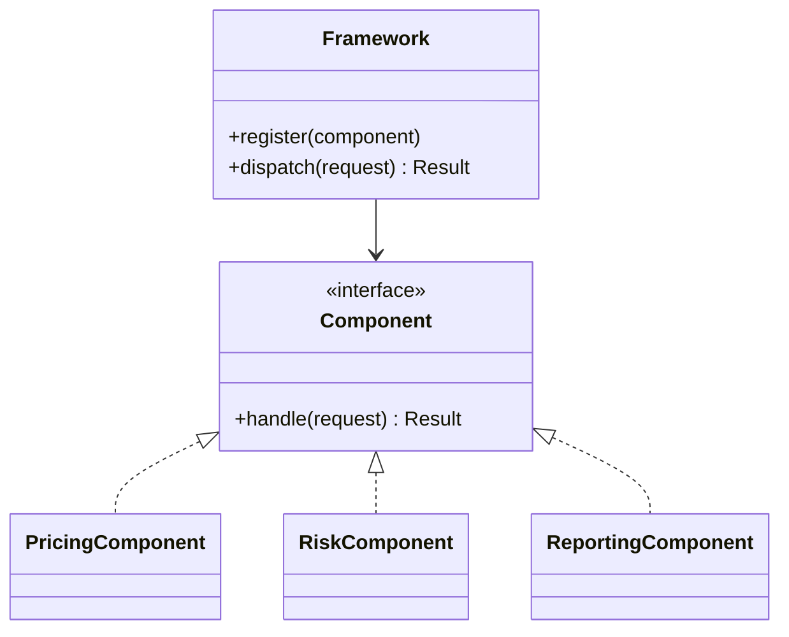

```mermaid
classDiagram
    class Component {
        <<interface>>
        +handle(request) Result
    }
    class Framework {
        +register(component)
        +dispatch(request) Result
    }
    class PricingComponent
    class RiskComponent
    class ReportingComponent
    Framework --> Component
    Component <|.. PricingComponent
    Component <|.. RiskComponent
    Component <|.. ReportingComponent
```
