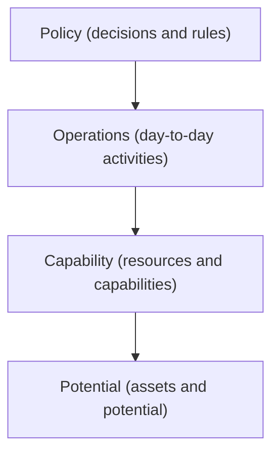

```mermaid
flowchart TB
    P["Policy (decisions and rules)"] --> O["Operations (day-to-day activities)"]
    O --> C["Capability (resources and capabilities)"]
    C --> PT["Potential (assets and potential)"]
```
