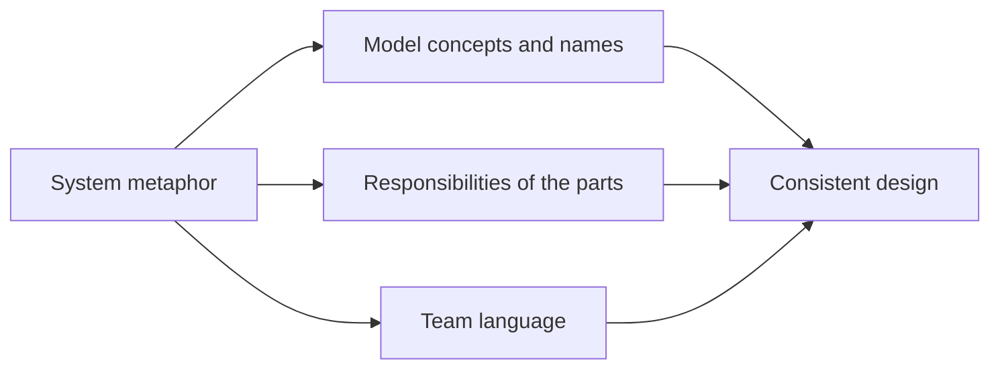

```mermaid
flowchart LR
    M["System metaphor"] --> A["Model concepts and names"]
    M --> B["Responsibilities of the parts"]
    M --> C["Team language"]
    A --> D["Consistent design"]
    B --> D
    C --> D
```
