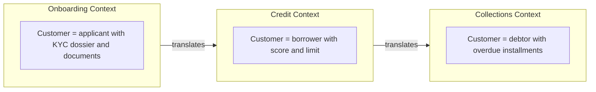

```mermaid
flowchart LR
    subgraph Onboarding ["Onboarding Context"]
        O1["Customer = applicant with KYC dossier and documents"]
    end
    subgraph Credito ["Credit Context"]
        R1["Customer = borrower with score and limit"]
    end
    subgraph Cobranca ["Collections Context"]
        C1["Customer = debtor with overdue installments"]
    end
    Onboarding -->|"translates"| Credito
    Credito -->|"translates"| Cobranca
```
