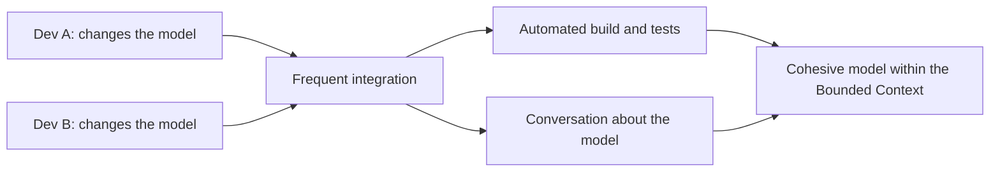

```mermaid
flowchart LR
    A["Dev A: changes the model"] --> I["Frequent integration"]
    B["Dev B: changes the model"] --> I
    I --> T["Automated build and tests"]
    I --> C["Conversation about the model"]
    T --> M["Cohesive model within the Bounded Context"]
    C --> M
```
