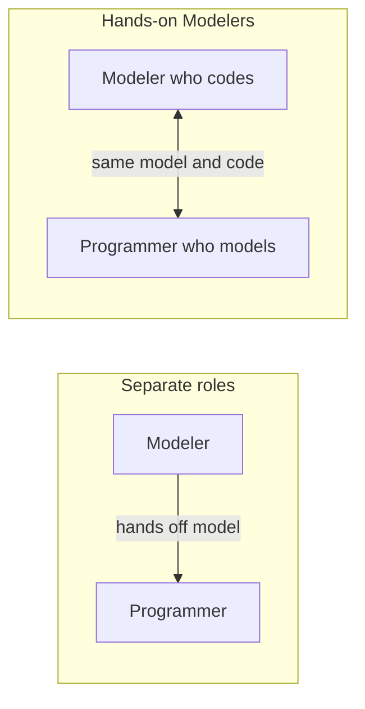

```mermaid
flowchart LR
    subgraph Separado ["Separate roles"]
        A1["Modeler"] -->|"hands off model"| B1["Programmer"]
    end
    subgraph Hands ["Hands-on Modelers"]
        A2["Modeler who codes"] <-->|"same model and code"| B2["Programmer who models"]
    end
```
