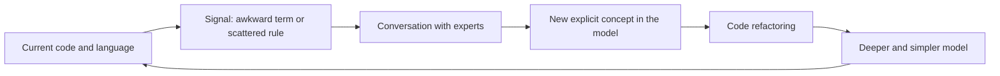

```mermaid
flowchart LR
    A["Current code and language"] --> B["Signal: awkward term or scattered rule"]
    B --> C["Conversation with experts"]
    C --> D["New explicit concept in the model"]
    D --> E["Code refactoring"]
    E --> F["Deeper and simpler model"]
    F --> A
```
