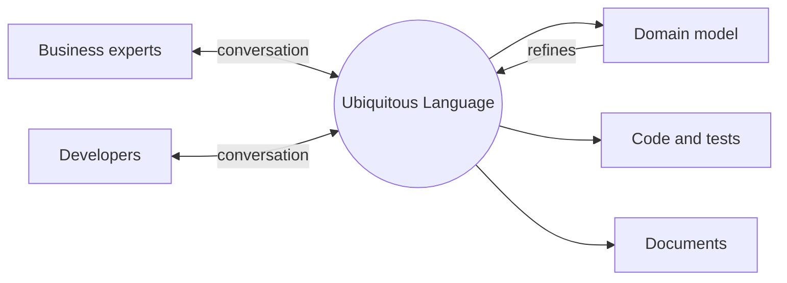

```mermaid
flowchart LR
    E["Business experts"] <-->|"conversation"| L(("Ubiquitous Language"))
    D["Developers"] <-->|"conversation"| L
    L --> M["Domain model"]
    L --> C["Code and tests"]
    L --> Doc["Documents"]
    M -->|"refines"| L
```
