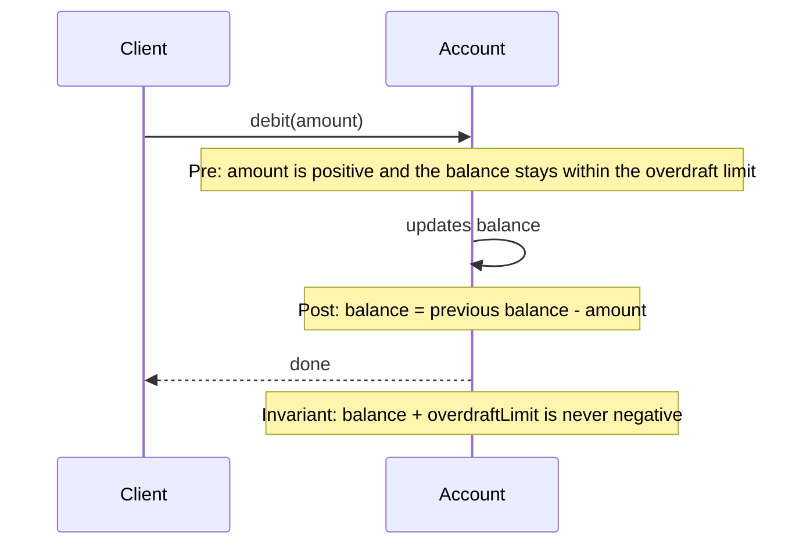

```mermaid
sequenceDiagram
    participant C as Client
    participant A as Account
    C->>A: debit(amount)
    Note over A: Pre: amount is positive and the balance stays within the overdraft limit
    A->>A: updates balance
    Note over A: Post: balance = previous balance - amount
    A-->>C: done
    Note over A: Invariant: balance + overdraftLimit is never negative
```
