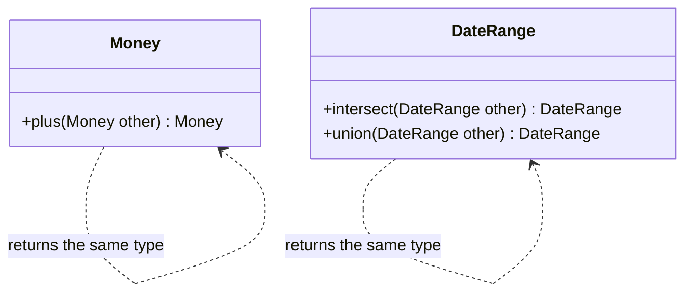

```mermaid
classDiagram
    class Money {
        +plus(Money other) Money
    }
    class DateRange {
        +intersect(DateRange other) DateRange
        +union(DateRange other) DateRange
    }
    Money ..> Money : returns the same type
    DateRange ..> DateRange : returns the same type
```
