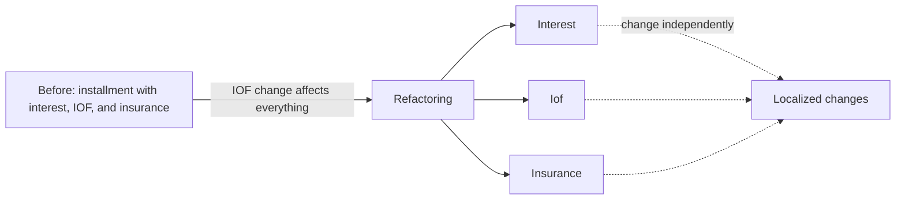

```mermaid
flowchart LR
    A["Before: installment with interest, IOF, and insurance"] -->|"IOF change affects everything"| B["Refactoring"]
    B --> C["Interest"]
    B --> D["Iof"]
    B --> E["Insurance"]
    C -.->|"change independently"| F["Localized changes"]
    D -.-> F
    E -.-> F
```
