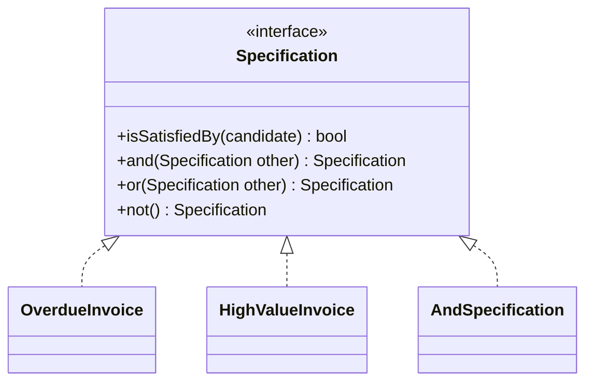

```mermaid
classDiagram
    class Specification {
        <<interface>>
        +isSatisfiedBy(candidate) bool
        +and(Specification other) Specification
        +or(Specification other) Specification
        +not() Specification
    }
    class OverdueInvoice
    class HighValueInvoice
    class AndSpecification
    Specification <|.. OverdueInvoice
    Specification <|.. HighValueInvoice
    Specification <|.. AndSpecification
```
