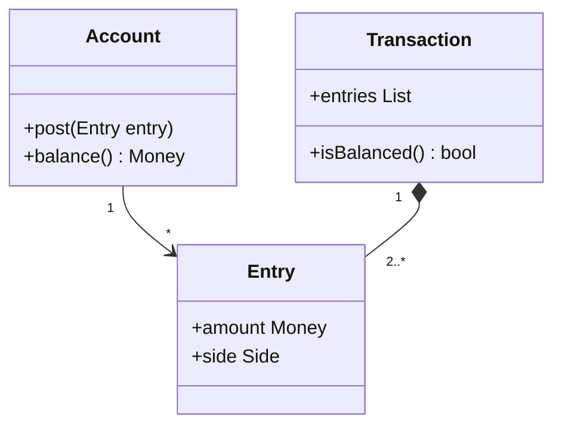

```mermaid
classDiagram
    class Account {
        +post(Entry entry)
        +balance() Money
    }
    class Entry {
        +amount Money
        +side Side
    }
    class Transaction {
        +entries List
        +isBalanced() bool
    }
    Account "1" --> "*" Entry
    Transaction "1" *-- "2..*" Entry
```
