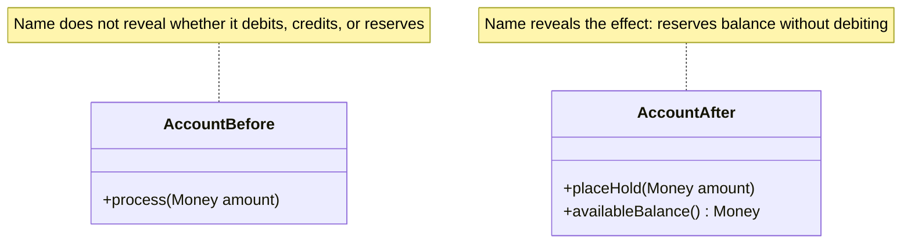

```mermaid
classDiagram
    class AccountBefore {
        +process(Money amount)
    }
    class AccountAfter {
        +placeHold(Money amount)
        +availableBalance() Money
    }
    note for AccountBefore "Name does not reveal whether it debits, credits, or reserves"
    note for AccountAfter "Name reveals the effect: reserves balance without debiting"
```
