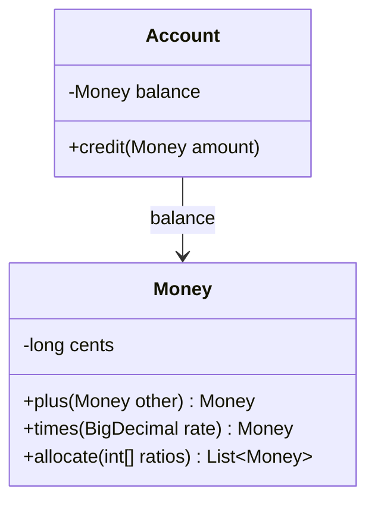

```mermaid
classDiagram
    class Account {
        -Money balance
        +credit(Money amount)
    }
    class Money {
        -long cents
        +plus(Money other) Money
        +times(BigDecimal rate) Money
        +allocate(int[] ratios) List~Money~
    }
    Account --> Money : balance
```
