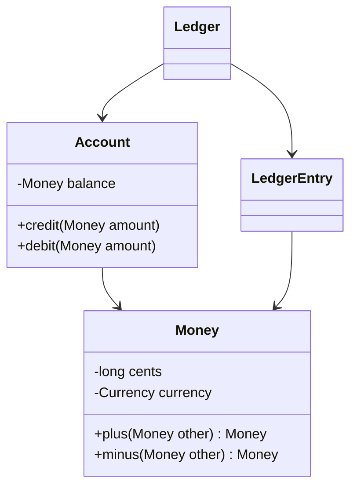

```mermaid
classDiagram
    class Money {
        -long cents
        -Currency currency
        +plus(Money other) Money
        +minus(Money other) Money
    }
    class Account {
        -Money balance
        +credit(Money amount)
        +debit(Money amount)
    }
    class Ledger
    class LedgerEntry
    Account --> Money
    Ledger --> Account
    Ledger --> LedgerEntry
    LedgerEntry --> Money
```
