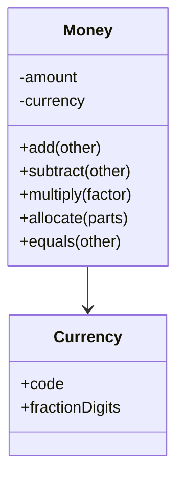

```mermaid
classDiagram
    class Money {
        -amount
        -currency
        +add(other)
        +subtract(other)
        +multiply(factor)
        +allocate(parts)
        +equals(other)
    }
    class Currency {
        +code
        +fractionDigits
    }
    Money --> Currency
```
