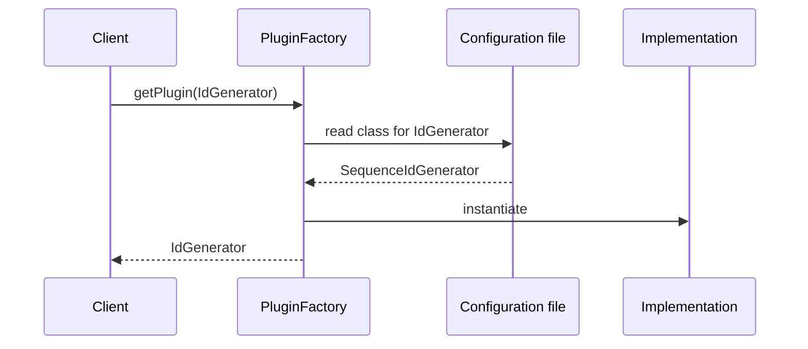

```mermaid
sequenceDiagram
    participant Client
    participant PluginFactory
    participant Config as Configuration file
    participant Impl as Implementation
    Client->>PluginFactory: getPlugin(IdGenerator)
    PluginFactory->>Config: read class for IdGenerator
    Config-->>PluginFactory: SequenceIdGenerator
    PluginFactory->>Impl: instantiate
    PluginFactory-->>Client: IdGenerator
```
