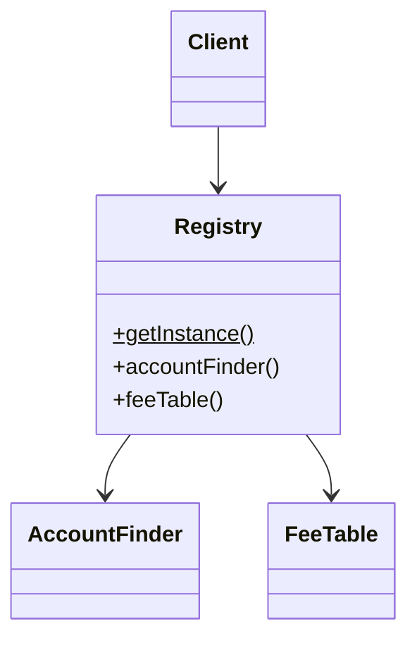

```mermaid
classDiagram
    class Registry {
        +getInstance()$
        +accountFinder()
        +feeTable()
    }
    class AccountFinder
    class FeeTable
    class Client
    Client --> Registry
    Registry --> AccountFinder
    Registry --> FeeTable
```
