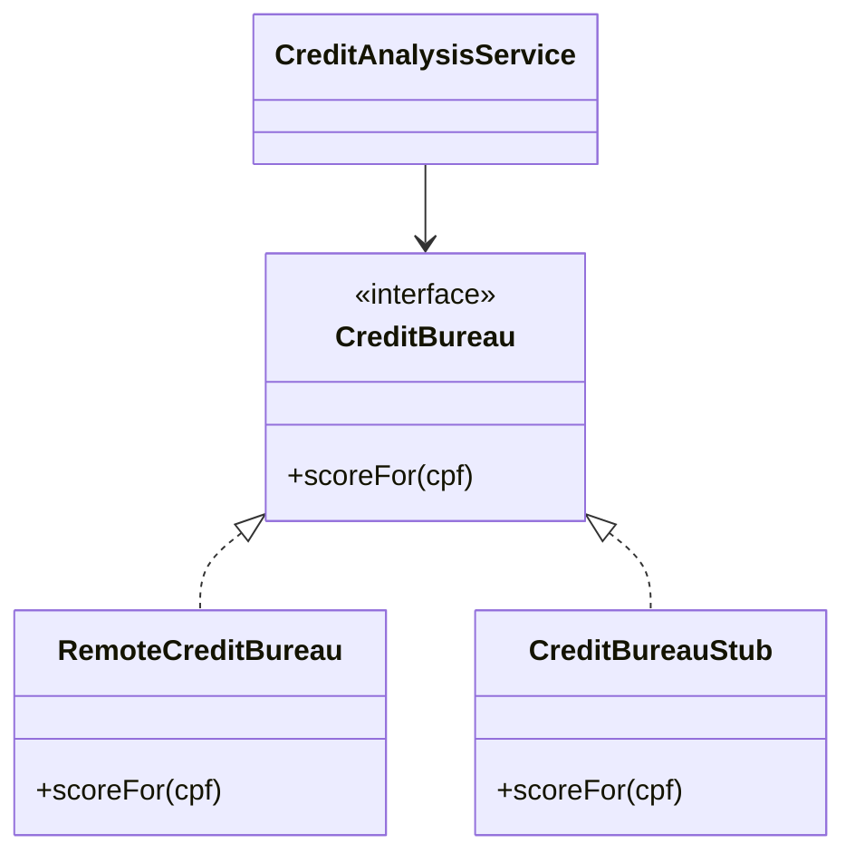

```mermaid
classDiagram
    class CreditBureau {
        <<interface>>
        +scoreFor(cpf)
    }
    class RemoteCreditBureau {
        +scoreFor(cpf)
    }
    class CreditBureauStub {
        +scoreFor(cpf)
    }
    class CreditAnalysisService
    CreditAnalysisService --> CreditBureau
    CreditBureau <|.. RemoteCreditBureau
    CreditBureau <|.. CreditBureauStub
```
