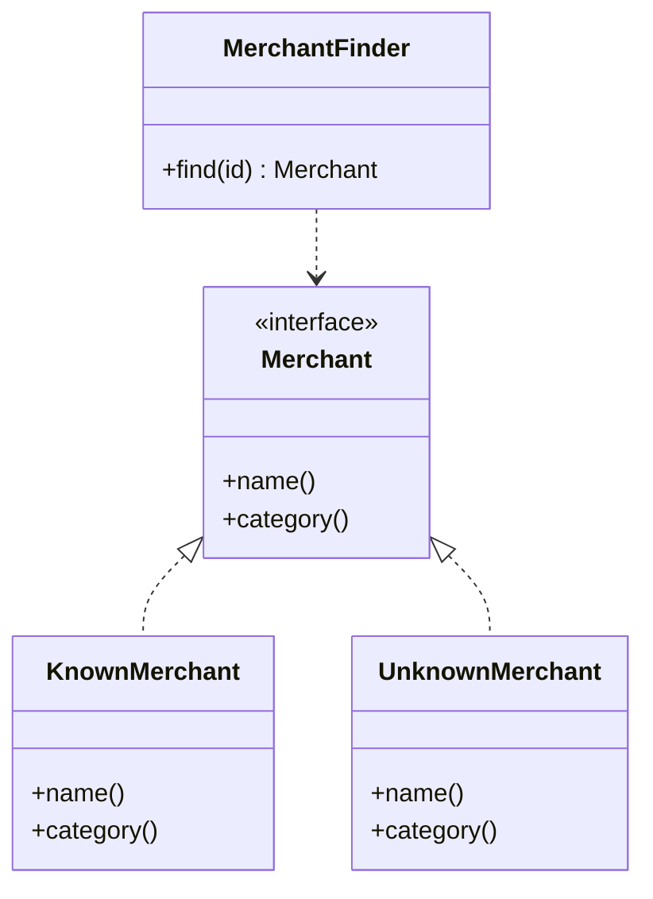

```mermaid
classDiagram
    class Merchant {
        <<interface>>
        +name()
        +category()
    }
    class KnownMerchant {
        +name()
        +category()
    }
    class UnknownMerchant {
        +name()
        +category()
    }
    class MerchantFinder {
        +find(id) Merchant
    }
    Merchant <|.. KnownMerchant
    Merchant <|.. UnknownMerchant
    MerchantFinder ..> Merchant
```
