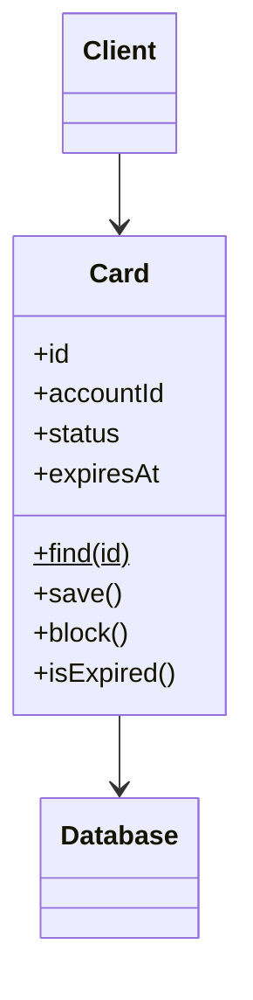

```mermaid
classDiagram
    class Client
    class Card {
        +id
        +accountId
        +status
        +expiresAt
        +find(id)$
        +save()
        +block()
        +isExpired()
    }
    class Database
    Client --> Card
    Card --> Database
```
