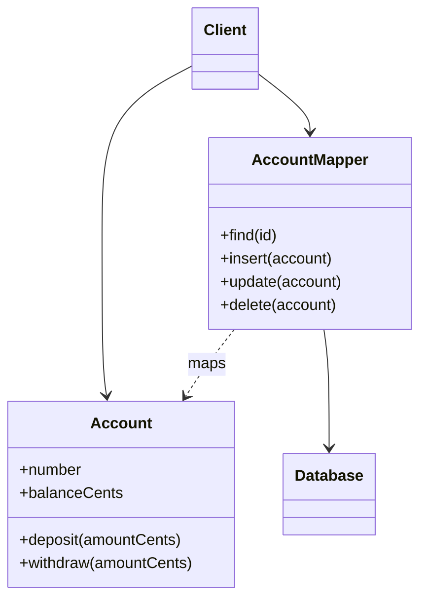

```mermaid
classDiagram
    class Client
    class Account {
        +number
        +balanceCents
        +deposit(amountCents)
        +withdraw(amountCents)
    }
    class AccountMapper {
        +find(id)
        +insert(account)
        +update(account)
        +delete(account)
    }
    class Database
    Client --> AccountMapper
    Client --> Account
    AccountMapper ..> Account : maps
    AccountMapper --> Database
```
