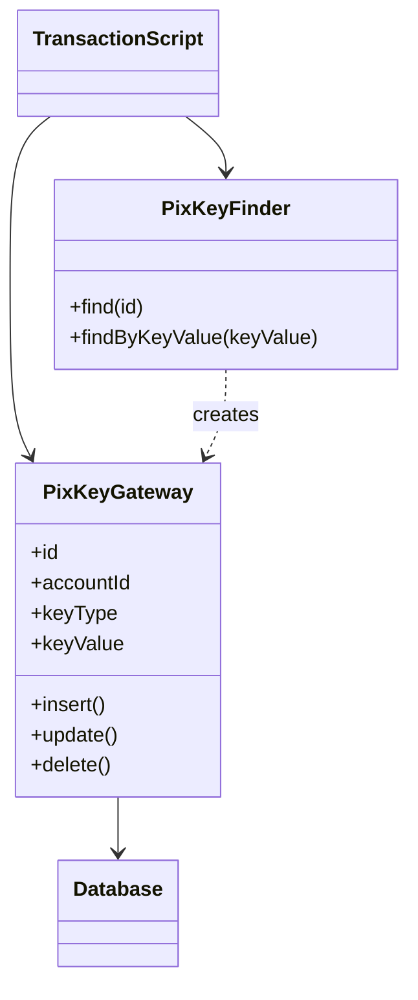

```mermaid
classDiagram
    class PixKeyFinder {
        +find(id)
        +findByKeyValue(keyValue)
    }
    class PixKeyGateway {
        +id
        +accountId
        +keyType
        +keyValue
        +insert()
        +update()
        +delete()
    }
    class TransactionScript
    class Database
    TransactionScript --> PixKeyFinder
    TransactionScript --> PixKeyGateway
    PixKeyFinder ..> PixKeyGateway : creates
    PixKeyGateway --> Database
```
