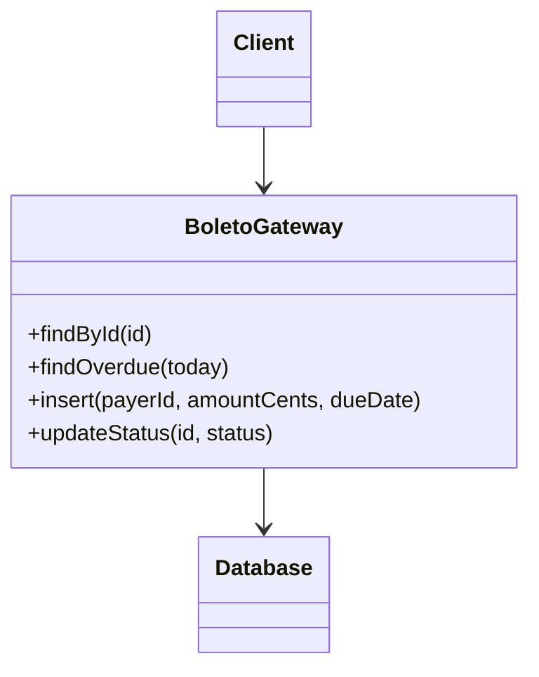

```mermaid
classDiagram
    class Client
    class BoletoGateway {
        +findById(id)
        +findOverdue(today)
        +insert(payerId, amountCents, dueDate)
        +updateStatus(id, status)
    }
    class Database
    Client --> BoletoGateway
    BoletoGateway --> Database
```
