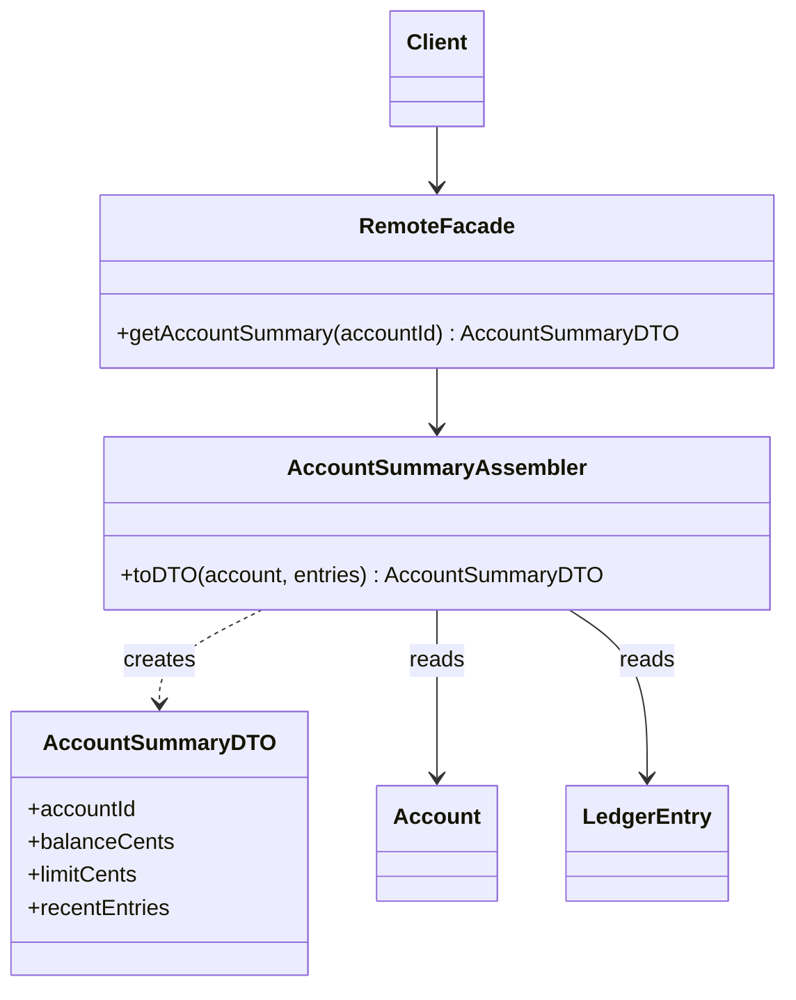

```mermaid
classDiagram
    class Client
    class RemoteFacade {
        +getAccountSummary(accountId) AccountSummaryDTO
    }
    class AccountSummaryAssembler {
        +toDTO(account, entries) AccountSummaryDTO
    }
    class AccountSummaryDTO {
        +accountId
        +balanceCents
        +limitCents
        +recentEntries
    }
    class Account
    class LedgerEntry
    Client --> RemoteFacade
    RemoteFacade --> AccountSummaryAssembler
    AccountSummaryAssembler ..> AccountSummaryDTO : creates
    AccountSummaryAssembler --> Account : reads
    AccountSummaryAssembler --> LedgerEntry : reads
```
