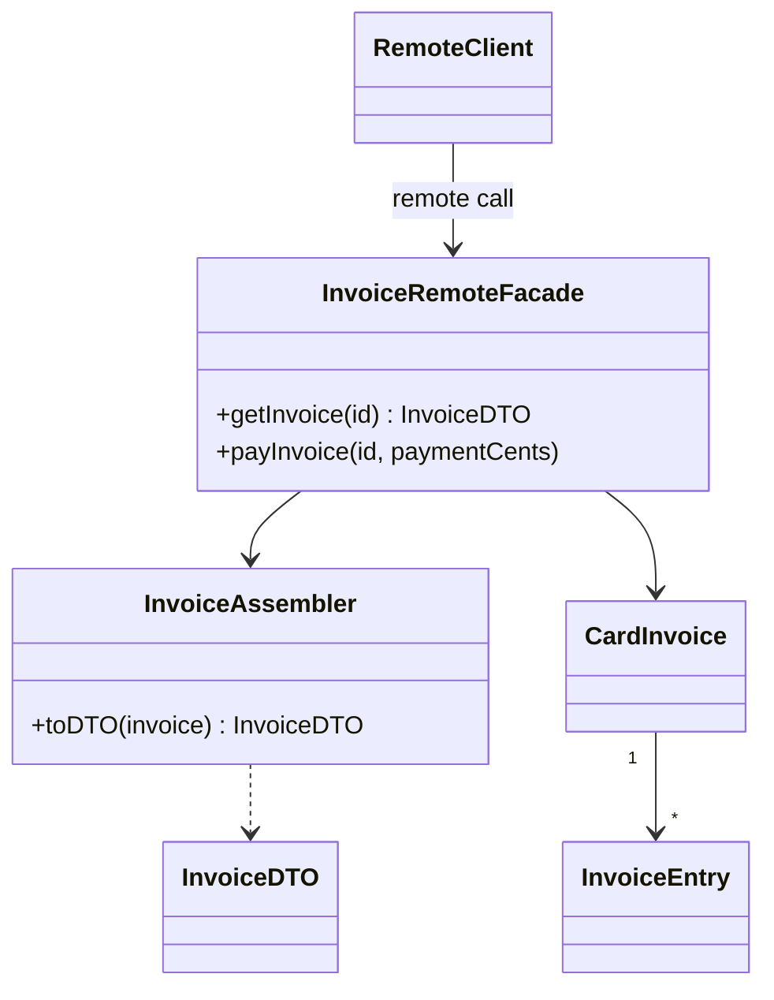

```mermaid
classDiagram
    class RemoteClient
    class InvoiceRemoteFacade {
        +getInvoice(id) InvoiceDTO
        +payInvoice(id, paymentCents)
    }
    class InvoiceAssembler {
        +toDTO(invoice) InvoiceDTO
    }
    class CardInvoice
    class InvoiceEntry
    class InvoiceDTO
    RemoteClient --> InvoiceRemoteFacade : remote call
    InvoiceRemoteFacade --> InvoiceAssembler
    InvoiceRemoteFacade --> CardInvoice
    CardInvoice "1" --> "*" InvoiceEntry
    InvoiceAssembler ..> InvoiceDTO
```
