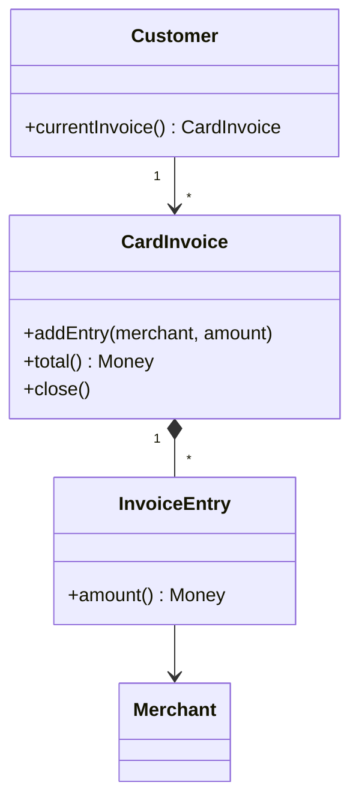

```mermaid
classDiagram
    class Customer {
        +currentInvoice() CardInvoice
    }
    class CardInvoice {
        +addEntry(merchant, amount)
        +total() Money
        +close()
    }
    class InvoiceEntry {
        +amount() Money
    }
    class Merchant
    Customer "1" --> "*" CardInvoice
    CardInvoice "1" *-- "*" InvoiceEntry
    InvoiceEntry --> Merchant
```
