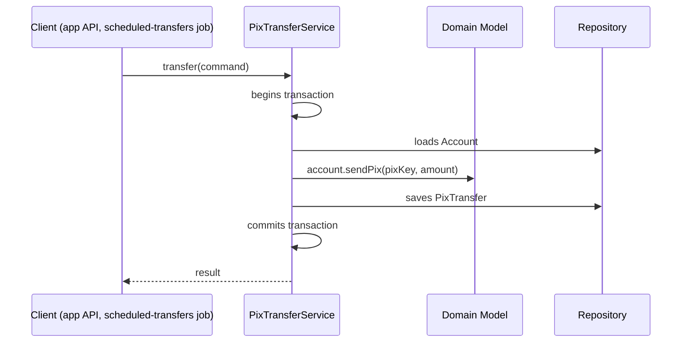

```mermaid
sequenceDiagram
    participant UI as Client (app API, scheduled-transfers job)
    participant S as PixTransferService
    participant D as Domain Model
    participant R as Repository
    UI->>S: transfer(command)
    S->>S: begins transaction
    S->>R: loads Account
    S->>D: account.sendPix(pixKey, amount)
    S->>R: saves PixTransfer
    S->>S: commits transaction
    S-->>UI: result
```
