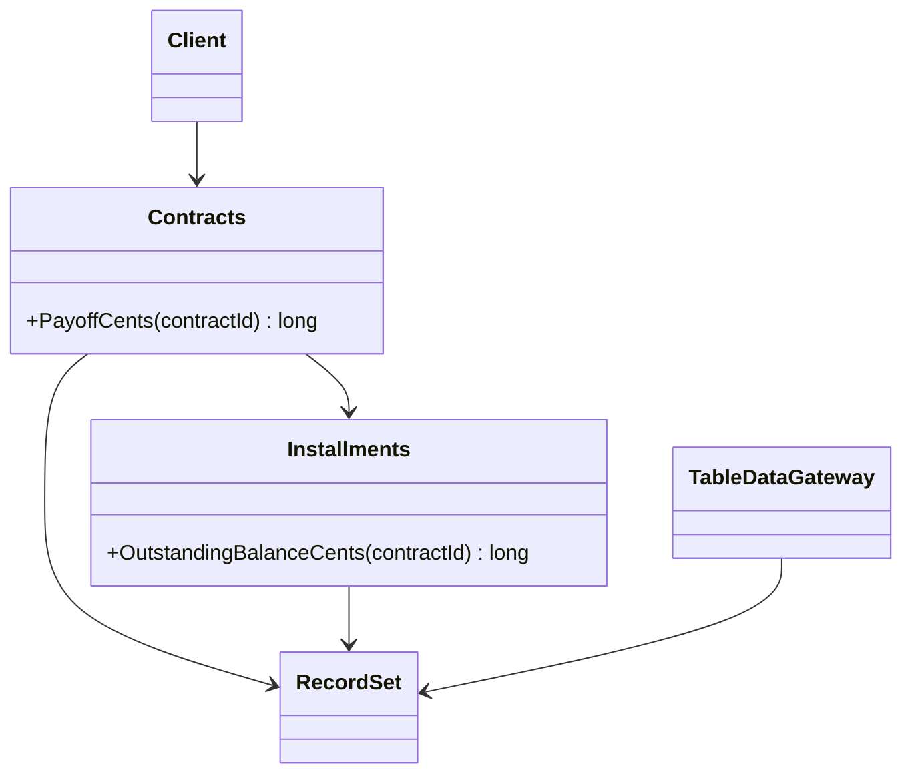

```mermaid
classDiagram
    class Client
    class Contracts {
        +PayoffCents(contractId) long
    }
    class Installments {
        +OutstandingBalanceCents(contractId) long
    }
    class RecordSet
    class TableDataGateway
    Client --> Contracts
    Contracts --> Installments
    Contracts --> RecordSet
    Installments --> RecordSet
    TableDataGateway --> RecordSet
```
