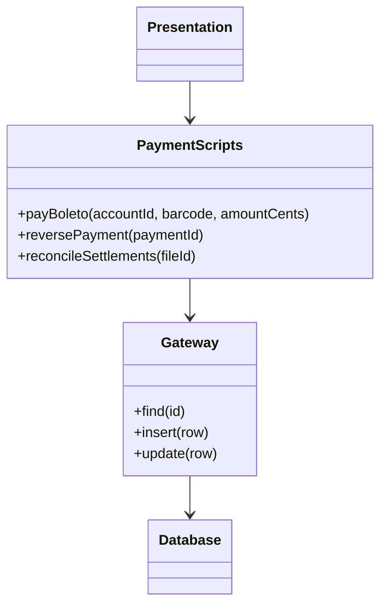

```mermaid
classDiagram
    class Presentation
    class PaymentScripts {
        +payBoleto(accountId, barcode, amountCents)
        +reversePayment(paymentId)
        +reconcileSettlements(fileId)
    }
    class Gateway {
        +find(id)
        +insert(row)
        +update(row)
    }
    class Database
    Presentation --> PaymentScripts
    PaymentScripts --> Gateway
    Gateway --> Database
```
