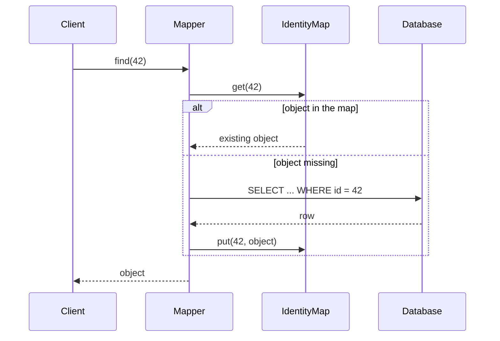

```mermaid
sequenceDiagram
    participant Client
    participant Mapper
    participant IdentityMap
    participant Database
    Client->>Mapper: find(42)
    Mapper->>IdentityMap: get(42)
    alt object in the map
        IdentityMap-->>Mapper: existing object
    else object missing
        Mapper->>Database: SELECT ... WHERE id = 42
        Database-->>Mapper: row
        Mapper->>IdentityMap: put(42, object)
    end
    Mapper-->>Client: object
```
