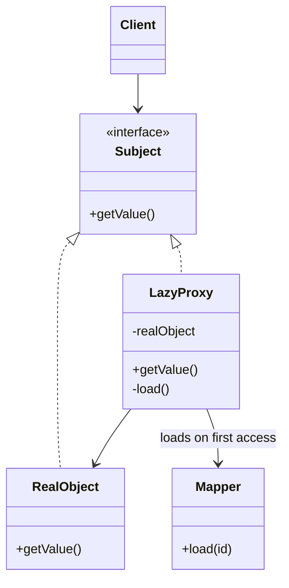

```mermaid
classDiagram
    class Client
    class Subject {
        <<interface>>
        +getValue()
    }
    class RealObject {
        +getValue()
    }
    class LazyProxy {
        -realObject
        +getValue()
        -load()
    }
    class Mapper {
        +load(id)
    }
    Client --> Subject
    Subject <|.. RealObject
    Subject <|.. LazyProxy
    LazyProxy --> Mapper : loads on first access
    LazyProxy --> RealObject
```
