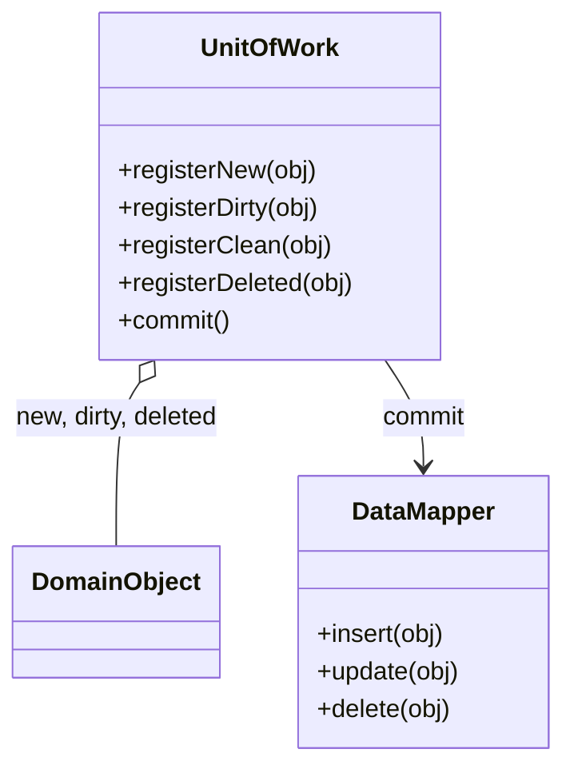

```mermaid
classDiagram
    class UnitOfWork {
        +registerNew(obj)
        +registerDirty(obj)
        +registerClean(obj)
        +registerDeleted(obj)
        +commit()
    }
    class DomainObject
    class DataMapper {
        +insert(obj)
        +update(obj)
        +delete(obj)
    }
    UnitOfWork o-- DomainObject : new, dirty, deleted
    UnitOfWork --> DataMapper : commit
```
